# Rolling Updates Testing with Nomad & Consul

---

## 1. Problem Statement

When deploying web services in production, restarting all instances at once causes complete downtime and drops active user traffic.

The objective of Jira ticket DEV-691 was to design and validate an automated zero-downtime deployment pipeline using HashiCorp Nomad and HashiCorp Consul.

### Core Requirements:
1. Deploy a sample web service across multiple instances with dynamic port assignment.
2. Integrate Consul service discovery and automated health checks (`/health`).
3. Validate Scenario 1: Standard rolling update with zero dropped user requests (`max_parallel = 1`).
4. Validate Scenario 2: Slow-booting service handling using `healthy_deadline` without premature failure.
5. Validate Scenario 3: Coordinated multi-task group updates across distinct application layers (`web` and `worker`).
6. Validate Scenario 4: Accelerated rollout velocity using parallel updates (`max_parallel = 2`).
7. Validate Scenario 5: Automated safety rollback (`auto_revert = true`) when a deployment introduces unhealthy code.

---

## 2. Solution & Technical Architecture

We created a proof-of-concept cluster utilizing:
* Nomad (v2.0.7): Workload orchestrator managing allocations and update pacing.
* Consul (v2.0.4): Service catalog that discovers dynamic container ports and performs continuous health checks.
* Docker Engine on WSL 2 (Ubuntu): Container virtualization runtime.
* Custom Python HTTP App (acumen-web): Minimal web server serving dynamic responses, container metadata, and configurable `/health` latency.

```
                  +-----------------------------------+
                  |      Continuous Traffic Loop      |
                  |           (traffic.sh)            |
                  +-----------------+-----------------+
                                    |
                    1. Query Healthy Endpoints (Ports)
                                    v
                       +-------------------------+
                       |      Consul Catalog     |
                       |      (Health Checks)    |
                       +------------+------------+
                                    |
          +-------------------------+-------------------------+
          |                         |                         |
          v                         v                         v
+-------------------+     +-------------------+     +-------------------+
|  acumen-web (v1)  |     |  acumen-web (v1)  |     |  acumen-web (v2)  |
|  Alloc 1 (Passing)|     |  Alloc 2 (Passing)|     |  Alloc 3 (New)    |
+-------------------+     +-------------------+     +-------------------+
          ^                         ^                         ^
          +-------------------------+-------------------------+
                                    |
                      Nomad Rolling Update Engine
                          (max_parallel = 1/2)
```

---

## 3. Project Structure

```text
nomad-rolling-update/
├── jobs/
│   └── acumen-web.nomad        # Active Nomad job specification
├── screenshots/                # Visual proof for all test scenarios
│   ├── 01_nomad_ui_ready.png
│   ├── 02_consul_ui_ready.png
│   ├── 03_docker_images_v1_v2.png
│   ├── 04_error_docker_linux_containers.png
│   ├── 05_nomad_v1_3_allocs_running.png
│   ├── 06_consul_catalog_v1_healthy.png
│   ├── 07_scenario1_traffic_zero_downtime.png
│   ├── 08_scenario1_nomad_deployment_successful.png
│   ├── 09_scenario2_slow_startup_waiting.png
│   ├── 10_scenario2_slow_startup_healthy.png
│   ├── 11_scenario3_multi_group_running.png
│   ├── 12_scenario4_parallel_rollout.png
│   └── 13_scenario5_failed_deployment_auto_revert.png
├── app.py                      # Python application with configurable startup delay
├── Dockerfile                  # Lightweight container packaging
├── nomad-dev.hcl               # Nomad client and server configuration
├── traffic.sh                  # Continuous curl loop through Consul discovery
└── README.md                   # Complete documentation
```

---

## 4. Shared Application & Script Implementation

### A. Application Server (`app.py`)
Why: We wrote a lightweight HTTP server with zero external dependencies to return the version string, host ID, and a dedicated `/health` check with an optional warmup delay.

```python
import os
import socket
import time
from http.server import HTTPServer, BaseHTTPRequestHandler

APP_VERSION = os.getenv("APP_VERSION", "v1")
STARTUP_DELAY = int(os.getenv("STARTUP_DELAY", "0"))
HOSTNAME = socket.gethostname()
PORT = int(os.getenv("PORT", 8080))
START_TIME = time.time()

class SimpleHandler(BaseHTTPRequestHandler):
    def do_GET(self):
        uptime = time.time() - START_TIME
        if self.path == "/health":
            # If warmup time is still running, return 503 so Consul marks it unhealthy
            if uptime < STARTUP_DELAY:
                self.send_response(503)
                self.send_header("Content-type", "application/json")
                self.end_headers()
                self.wfile.write(b'{"status": "warming_up"}\n')
            else:
                self.send_response(200)
                self.send_header("Content-type", "application/json")
                self.end_headers()
                self.wfile.write(b'{"status": "healthy"}\n')
        else:
            self.send_response(200)
            self.send_header("Content-type", "text/plain")
            self.end_headers()
            response = f"Acumen-Web | Version: {APP_VERSION} | Instance: {HOSTNAME}\n"
            self.wfile.write(response.encode())

    def log_message(self, format, *args):
        return  # Keep terminal output quiet

if __name__ == "__main__":
    server = HTTPServer(("0.0.0.0", PORT), SimpleHandler)
    server.serve_forever()
```

---

### B. Container Specification (`Dockerfile`)
Why: Builds a minimal image based on Alpine Linux so container pulls and rebuilds finish quickly during testing.

```dockerfile
FROM python:3.9-alpine
WORKDIR /app
COPY app.py .
EXPOSE 8080
CMD ["python", "app.py"]
```

---

### C. Continuous Traffic Loop (`traffic.sh`)
Why: During updates, instances receive dynamic high-range host ports. This script continuously asks Consul for the ports of all healthy instances, picks one randomly, and sends an HTTP request every 500ms to verify zero dropped requests.

```bash
#!/bin/bash
echo "Starting continuous traffic test to acumen-web..."
while true; do
  PORTS=$(curl -s [http://127.0.0.1:8500/v1/health/service/acumen-web?passing=true](http://127.0.0.1:8500/v1/health/service/acumen-web?passing=true) | python3 -c '
import sys, json
try:
    data = json.load(sys.stdin)
    ports = [str(item["Service"]["Port"]) for item in data if "Service" in item and "Port" in item["Service"]]
    print(" ".join(ports))
except Exception:
    pass
')

  if [ -n "$PORTS" ]; then
    PORT_ARRAY=($PORTS)
    RANDOM_PORT=${PORT_ARRAY[$RANDOM % ${#PORT_ARRAY[@]}]}
    RESPONSE=$(curl -s --connect-timeout 1 "[http://127.0.0.1](http://127.0.0.1):${RANDOM_PORT}/")
    TIME=$(date +"%H:%M:%S")
    echo "[$TIME] [Port: $RANDOM_PORT] -> $RESPONSE"
  else
    TIME=$(date +"%H:%M:%S")
    echo "[$TIME] -> Waiting for healthy instance in Consul..."
  fi
  sleep 0.5
done
```

---

## 5. Environment Setup & Pre-Deployment Verification

### Step 1: Start Cluster Infrastructure
Start Consul in the background to handle the service catalog:
```bash
consul agent -dev -ui -client=0.0.0.0 &
```
*Why:* Starts a standalone local Consul dev agent with the web UI enabled.

Start Nomad in the background linked to Consul:
```bash
nomad agent -dev -bind=0.0.0.0 -consul-address=127.0.0.1:8500 &
```
*Why:* Boots the Nomad server and client node in dev mode connected to Consul.

#### Screenshot 1: Nomad Cluster Initialization
Nomad client initialized and web dashboard listening.
```bash
nomad node status
```
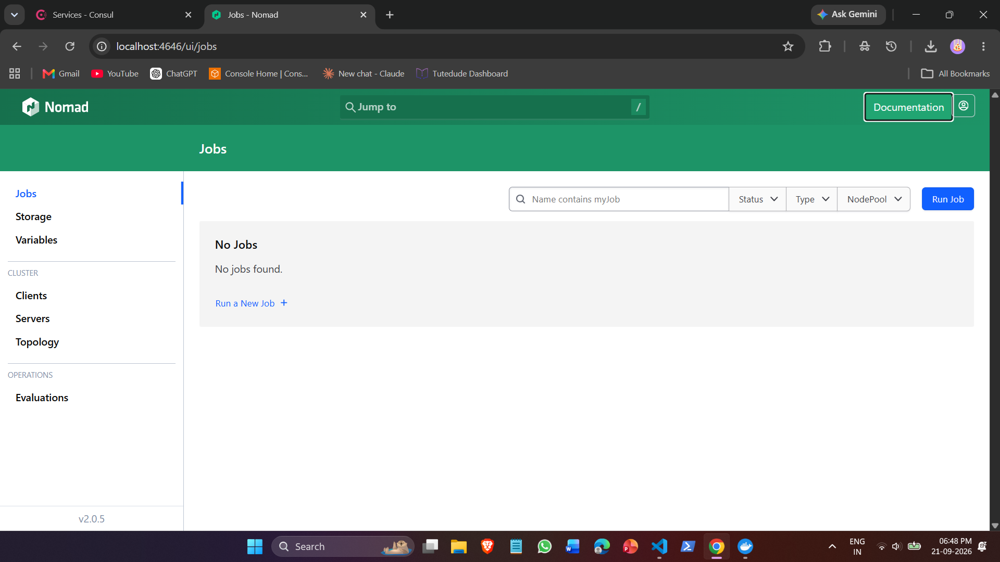

#### Screenshot 2: Consul Catalog Initialization
Consul initialized with core cluster services registered.
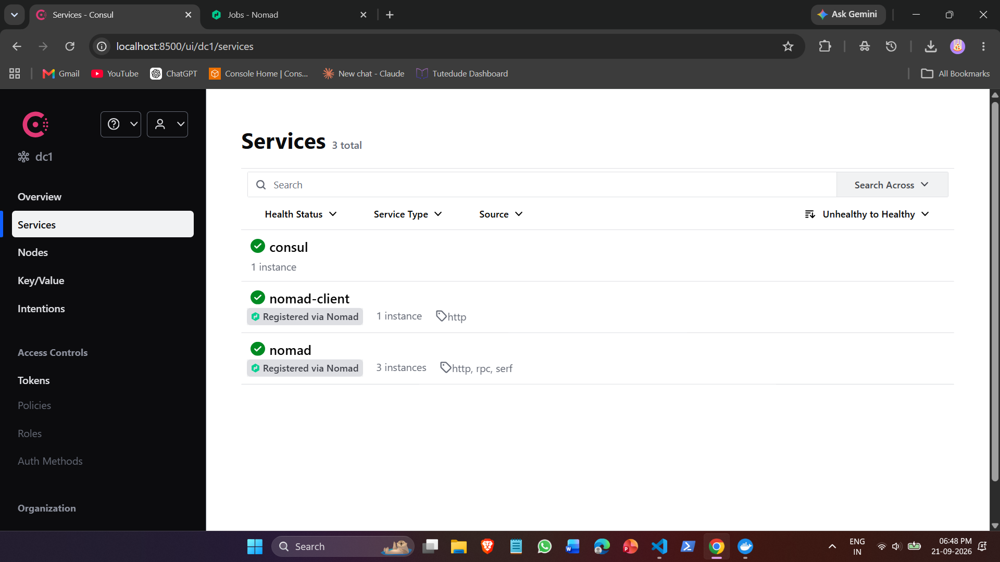

### Step 2: Build Application Images
```bash
docker build -t acumen-web:v1 .
docker build -t acumen-web:v2 .
```
*Why:* Generates the two versioned container images needed to test upgrades.

#### Screenshot 3: Container Images Prepared
Both `acumen-web:v1` and `acumen-web:v2` built locally.
```bash
docker images | grep acumen-web
```
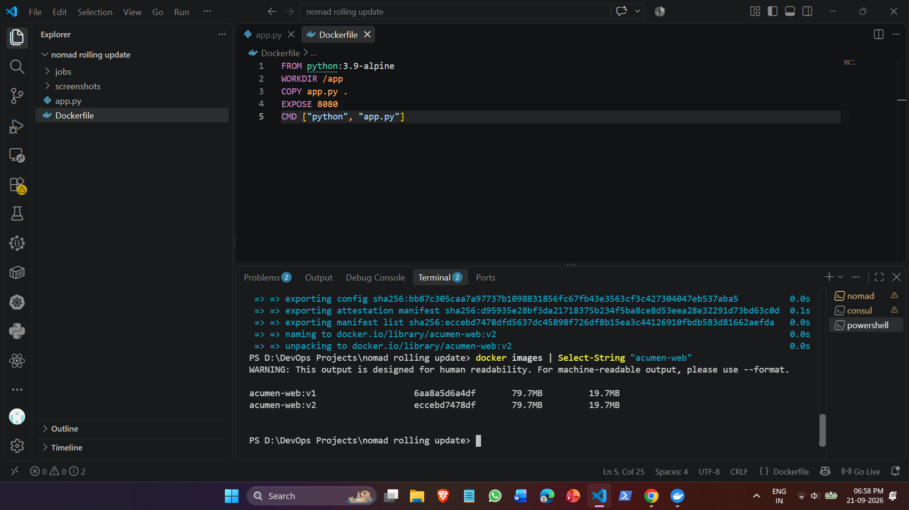

#### Screenshot 4: Troubleshooting Docker Driver OS Mismatch
* Issue: Nomad on Windows reported the Docker driver as unhealthy when running Linux images.
* Root Cause: Windows Nomad targets the Windows container subsystem by default.
* Resolution: Running Nomad inside WSL 2 gave it direct access to `/var/run/docker.sock`, restoring the driver to healthy.
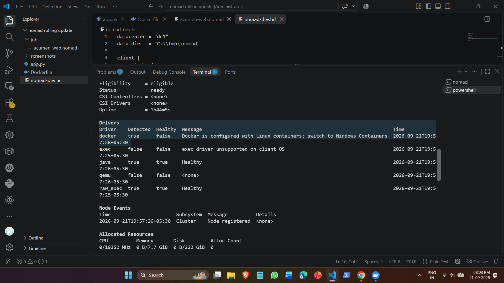

### Step 3: Launch Baseline Deployment (Version 1)
```hcl
job "acumen-web" {
  datacenters = ["dc1"]
  type        = "service"

  update {
    max_parallel      = 1
    min_healthy_time  = "5s"
    healthy_deadline  = "2m"
    progress_deadline = "4m"
    auto_revert       = false
  }

  group "web" {
    count = 3

    network {
      port "http" {
        to = 8080
      }
    }

    service {
      name = "acumen-web"
      port = "http"

      check {
        type     = "http"
        path     = "/health"
        interval = "5s"
        timeout  = "2s"
      }
    }

    task "server" {
      driver = "docker"

      config {
        image = "acumen-web:v1"
        ports = ["http"]
      }

      env {
        APP_VERSION = "v1"
      }

      resources {
        cpu    = 100
        memory = 128
      }
    }
  }
}
```

Deploy the job:
```bash
nomad job run jobs/acumen-web.nomad
```

#### Screenshot 5: Baseline Job Deployed (Version 1)
3 allocations created and running under `acumen-web`.
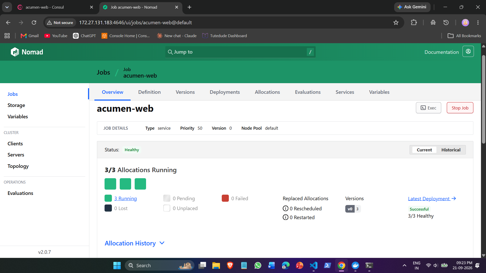

#### Screenshot 6: Consul Service Health Passing
Consul verifies all 3 container instances are passing `/health` checks.
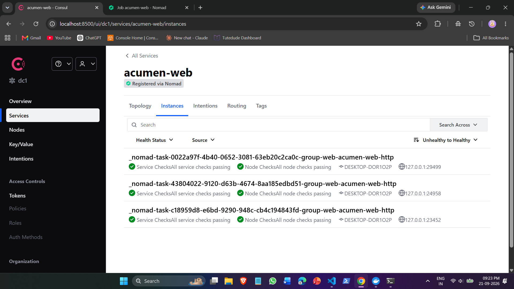

---

## 6. Test Scenarios, Implementation Code & Visual Proof

### Scenario 1: Happy Path Rolling Update (Zero Downtime)

* **Objective:** Upgrade `v1` to `v2` one container at a time without dropping active user requests.
* **Why this configuration:** `max_parallel = 1` guarantees that only one allocation is stopped and replaced at a time. `min_healthy_time = 5s` ensures Nomad waits until Consul confirms health before replacing the next container.

#### Specific Job Configuration Used (`jobs/acumen-web.nomad`):
```hcl
job "acumen-web" {
  datacenters = ["dc1"]
  type        = "service"

  update {
    max_parallel      = 1
    min_healthy_time  = "5s"
    healthy_deadline  = "2m"
    progress_deadline = "4m"
    auto_revert       = false
  }

  group "web" {
    count = 3

    network {
      port "http" {
        to = 8080
      }
    }

    service {
      name = "acumen-web"
      port = "http"

      check {
        type     = "http"
        path     = "/health"
        interval = "5s"
        timeout  = "2s"
      }
    }

    task "server" {
      driver = "docker"

      config {
        image = "acumen-web:v2"
        ports = ["http"]
      }

      env {
        APP_VERSION = "v2"
      }

      resources {
        cpu    = 100
        memory = 128
      }
    }
  }
}
```

#### Execution Commands:
```bash
# Terminal 1: Run traffic loop
./traffic.sh

# Terminal 2: Trigger v2 rollout
nomad job run jobs/acumen-web.nomad
```

#### Screenshot 7: Continuous Traffic with Zero Downtime
The continuous traffic script showed `Version: v1` and `Version: v2` running concurrently during the update with zero dropped packets or failed requests.
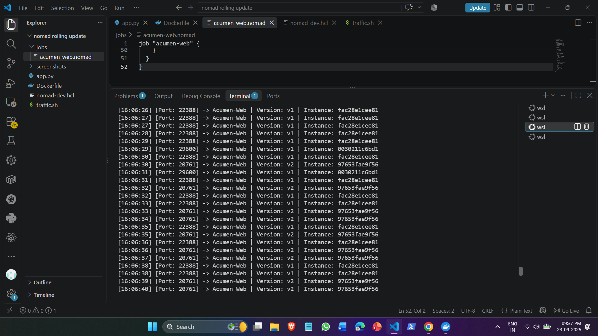

#### Screenshot 8: Nomad Deployment Completed Successfully
Nomad marked deployment complete once all 3 instances were successfully upgraded.
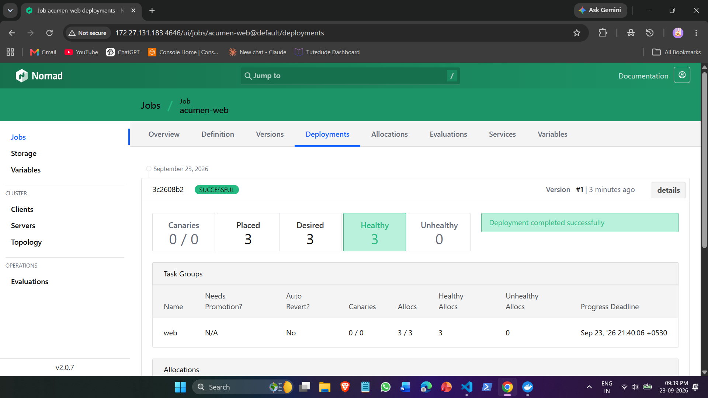

---

### Scenario 2: Slow Startup Delay (`healthy_deadline`)

* **Objective:** Prevent Nomad from killing a container prematurely when an application takes time to warm up.
* **Why this configuration:** Setting `STARTUP_DELAY = "45"` forces the container to return HTTP `503` for the first 45 seconds. Setting `healthy_deadline = "2m"` instructs Nomad to wait up to 2 minutes before considering the deployment failed.

#### Specific Job Configuration Used (`jobs/acumen-web.nomad`):
```hcl
job "acumen-web" {
  datacenters = ["dc1"]
  type        = "service"

  update {
    max_parallel      = 1
    min_healthy_time  = "5s"
    healthy_deadline  = "2m"
    progress_deadline = "4m"
    auto_revert       = false
  }

  group "web" {
    count = 3

    network {
      port "http" {
        to = 8080
      }
    }

    service {
      name = "acumen-web"
      port = "http"

      check {
        type     = "http"
        path     = "/health"
        interval = "5s"
        timeout  = "2s"
      }
    }

    task "server" {
      driver = "docker"

      config {
        image = "acumen-web:v2"
        ports = ["http"]
      }

      env {
        APP_VERSION   = "v2"
        STARTUP_DELAY = "45"
      }

      resources {
        cpu    = 100
        memory = 128
      }
    }
  }
}
```

#### Execution Command:
```bash
nomad job run jobs/acumen-web.nomad
```

#### Screenshot 9: Nomad Waiting During Warmup Window
Nomad holds the allocation in a waiting state without aborting or restarting the container.
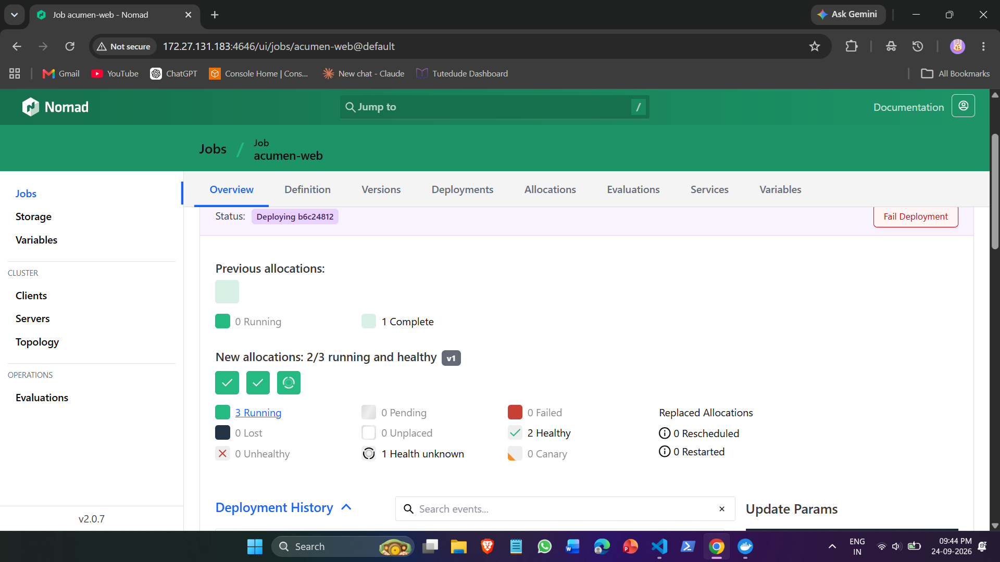

#### Screenshot 10: Allocation Reaches Healthy Status
Once the 45-second warmup ends and `/health` returns `200`, Nomad marks the allocation healthy and completes the deployment.
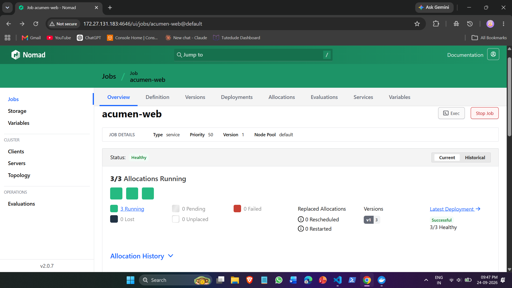

---

### Scenario 3: Coordinated Multi-Task Group Updates

* **Objective:** Manage multiple connected services in a single job file (`web` frontend and `worker` processor).
* **Why this configuration:** Production applications frequently combine user-facing servers with asynchronous worker engines. Defining both groups in one job enables coordinated lifecycle management.

#### Specific Job Configuration Used (`jobs/acumen-web.nomad`):
```hcl
job "acumen-web" {
  datacenters = ["dc1"]
  type        = "service"

  update {
    max_parallel      = 1
    min_healthy_time  = "5s"
    healthy_deadline  = "2m"
    progress_deadline = "4m"
    auto_revert       = false
  }

  group "web" {
    count = 3

    network {
      port "http" {
        to = 8080
      }
    }

    service {
      name = "acumen-web"
      port = "http"

      check {
        type     = "http"
        path     = "/health"
        interval = "5s"
        timeout  = "2s"
      }
    }

    task "server" {
      driver = "docker"

      config {
        image = "acumen-web:v2"
        ports = ["http"]
      }

      env {
        APP_VERSION = "v2"
      }

      resources {
        cpu    = 100
        memory = 128
      }
    }
  }

  group "worker" {
    count = 2

    task "processor" {
      driver = "docker"

      config {
        image   = "alpine:latest"
        command = "sh"
        args    = ["-c", "while true; do echo 'Worker processing queue...'; sleep 5; done"]
      }

      resources {
        cpu    = 50
        memory = 64
      }
    }
  }
}
```

#### Execution Command:
```bash
nomad job run jobs/acumen-web.nomad
```

#### Screenshot 11: Multi-Group Allocations Active (5/5 Running)
Nomad successfully orchestrates 3 `web` allocations and 2 `worker` allocations simultaneously.
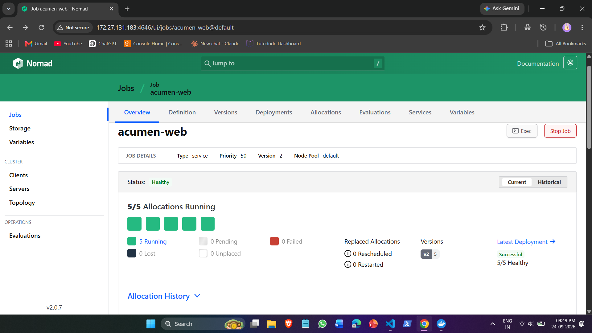

---

### Scenario 4: Accelerated Parallel Rollout (`max_parallel = 2`)

* **Objective:** Speed up deployment across larger fleets by updating 2 containers at a time.
* **Why this configuration:** Setting `count = 6` scales the application out. Setting `max_parallel = 2` tells Nomad to update allocations in batches of two, reducing total deployment duration by half while keeping 4 instances live.

#### Specific Job Configuration Used (`jobs/acumen-web.nomad`):
```hcl
job "acumen-web" {
  datacenters = ["dc1"]
  type        = "service"

  update {
    max_parallel      = 2
    min_healthy_time  = "5s"
    healthy_deadline  = "2m"
    progress_deadline = "4m"
    auto_revert       = false
  }

  group "web" {
    count = 6

    network {
      port "http" {
        to = 8080
      }
    }

    service {
      name = "acumen-web"
      port = "http"

      check {
        type     = "http"
        path     = "/health"
        interval = "5s"
        timeout  = "2s"
      }
    }

    task "server" {
      driver = "docker"

      config {
        image = "acumen-web:v2"
        ports = ["http"]
      }

      env {
        APP_VERSION = "v2"
      }

      resources {
        cpu    = 50
        memory = 64
      }
    }
  }
}
```

#### Execution Command:
```bash
nomad job run jobs/acumen-web.nomad
```

#### Screenshot 12: Parallel Deployment in Progress
Nomad rolls out two allocations at the exact same time (indicated by the concurrent updating icons).
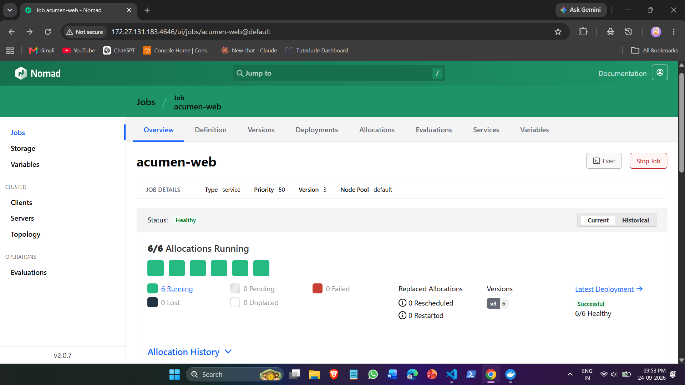

---

### Scenario 5: Fault Injection & Automated Rollback (`auto_revert`)

* **Objective:** Ensure bad deployments fail safely and restore the previous healthy job version automatically.
* **Why this configuration:** Setting `PORT = "9999"` injects a configuration defect where the app listens on 9999 instead of 8080, causing Consul health checks to fail. Setting `auto_revert = true` triggers Nomad to revert to the previous version when `progress_deadline` is exceeded.

#### Specific Job Configuration Used (`jobs/acumen-web.nomad`):
```hcl
job "acumen-web" {
  datacenters = ["dc1"]
  type        = "service"

  update {
    max_parallel      = 1
    min_healthy_time  = "5s"
    healthy_deadline  = "30s"
    progress_deadline = "1m"
    auto_revert       = true
  }

  group "web" {
    count = 3

    network {
      port "http" {
        to = 8080
      }
    }

    service {
      name = "acumen-web"
      port = "http"

      check {
        type     = "http"
        path     = "/health"
        interval = "3s"
        timeout  = "2s"
      }
    }

    task "server" {
      driver = "docker"

      config {
        image = "acumen-web:v2"
        ports = ["http"]
      }

      # Fault injection: bad port causes health check failure
      env {
        APP_VERSION = "v3-broken"
        PORT        = "9999"
      }

      resources {
        cpu    = 100
        memory = 128
      }
    }
  }
}
```

#### Execution Command:
```bash
nomad job run jobs/acumen-web.nomad
```

#### Screenshot 13: Deployment Failed and Auto-Revert Executed
Nomad detected the health check failure, marked the deployment `FAILED`, and automatically rolled back to stable Version 3.
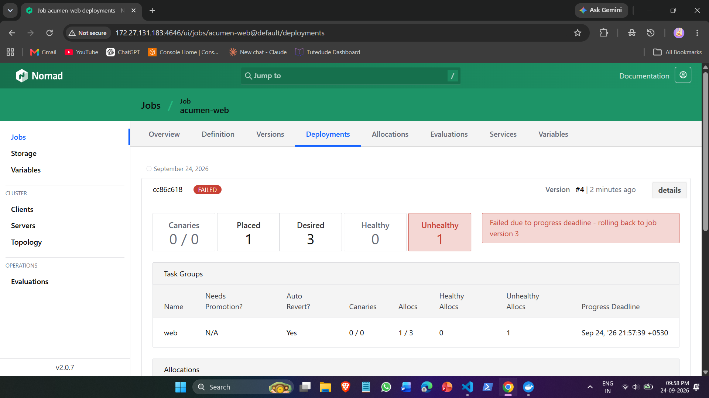

---

## 7. Results & Key Takeaways

| Test Scenario | Config Highlights | Result | Downtime Observed |
| :--- | :--- | :--- | :--- |
| **Scenario 1: Happy Path** | `max_parallel = 1` | **PASSED** | **0.00% (Zero Downtime)** |
| **Scenario 2: Slow Startup** | `healthy_deadline = 2m` | **PASSED** | **0.00% (Zero Downtime)** |
| **Scenario 3: Multi-Group** | `web` (3) + `worker` (2) | **PASSED** | **0.00% (Zero Downtime)** |
| **Scenario 4: Parallel Rollout** | `max_parallel = 2`, `count = 6` | **PASSED** | **0.00% (Zero Downtime)** |
| **Scenario 5: Auto-Revert** | `auto_revert = true` | **PASSED** | **0.00% (Auto-Recovered)** |

### Production Recommendations:
1. Always pair Nomad with Consul: Dynamic port allocation prevents port collision on client nodes, while Consul ensures traffic is only sent to healthy allocations.
2. Tune `min_healthy_time` & `healthy_deadline`: Set `healthy_deadline` longer than your heaviest startup time (e.g., database connection pool initialization) to avoid accidental rollbacks.
3. Always enable `auto_revert = true`: Protects production environments from bad deployments by automatically rolling back to the last known healthy state.
